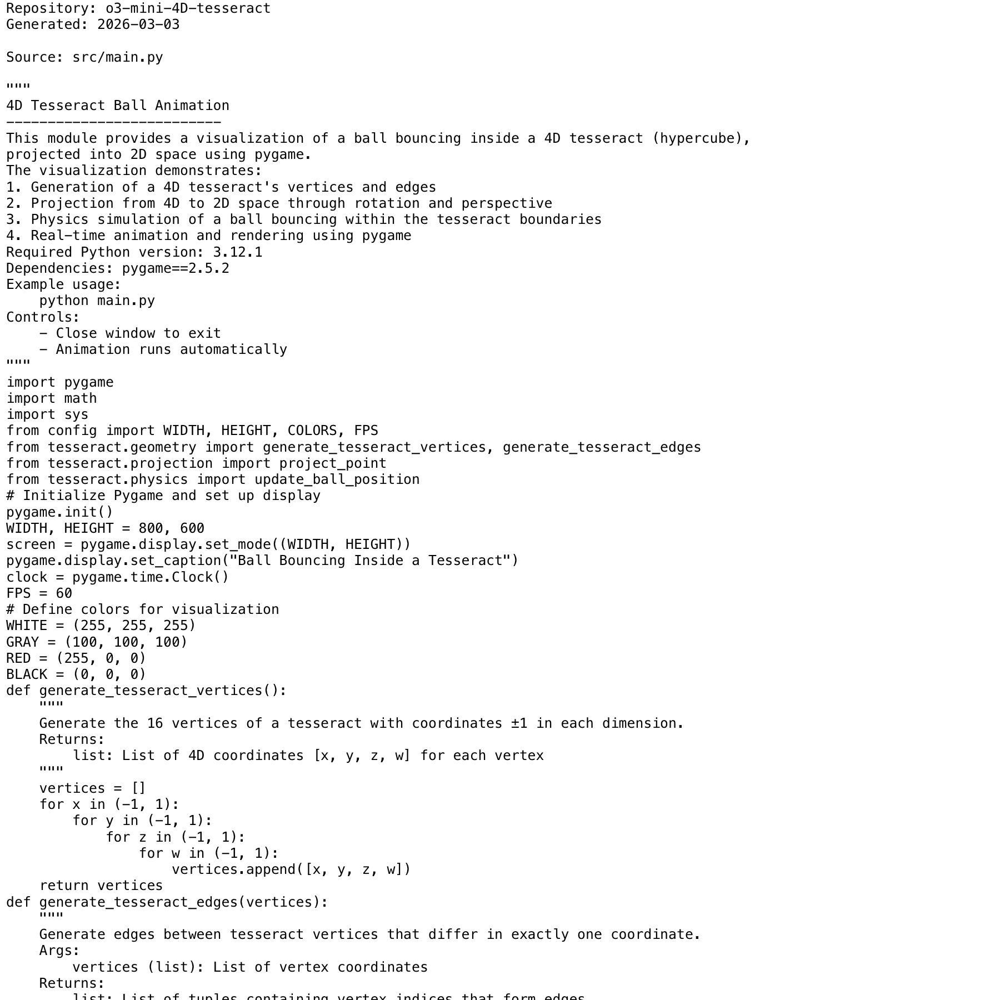

# Project Narrative & Proof

Generated: 2026-03-03

## User Journey
1. Discover the project value in the repository overview and launch instructions.
2. Run or open the build artifact for o3-mini-4D-tesseract and interact with the primary experience.
3. Observe output/behavior through the documented flow and visual/code evidence below.
4. Reuse or extend the project by following the repository structure and stack notes.

## Design Methodology
- Iterative implementation with working increments preserved in Git history.
- Show-don't-tell documentation style: direct assets and source excerpts instead of abstract claims.
- Traceability from concept to implementation through concrete files and modules.

## Progress
- Latest commit: 6e1e611 (2026-03-03) - docs: add professional README with badges
- Total commits: 2
- Current status: repository has baseline narrative + proof documentation and CI doc validation.

## Tech Stack
- Detected stack: Python, GitHub Actions

## Main Key Concepts
- Key module area: `docs`
- Key module area: `requirements`
- Key module area: `src`

## What I'm Bringing to the Table
- End-to-end ownership: from concept framing to implementation and quality gates.
- Engineering rigor: repeatable workflows, versioned progress, and implementation-first evidence.
- Product clarity: user-centered framing with explicit journey and value articulation.

## Show Don't Tell: Screenshots


## Show Don't Tell: Code Excerpt
Source: `src/main.py`

```py
"""
4D Tesseract Ball Animation
--------------------------
This module provides a visualization of a ball bouncing inside a 4D tesseract (hypercube),
projected into 2D space using pygame.
The visualization demonstrates:
1. Generation of a 4D tesseract's vertices and edges
2. Projection from 4D to 2D space through rotation and perspective
3. Physics simulation of a ball bouncing within the tesseract boundaries
4. Real-time animation and rendering using pygame
Required Python version: 3.12.1
Dependencies: pygame==2.5.2
Example usage:
    python main.py
Controls:
    - Close window to exit
    - Animation runs automatically
"""
import pygame
import math
import sys
from config import WIDTH, HEIGHT, COLORS, FPS
from tesseract.geometry import generate_tesseract_vertices, generate_tesseract_edges
from tesseract.projection import project_point
from tesseract.physics import update_ball_position
# Initialize Pygame and set up display
pygame.init()
WIDTH, HEIGHT = 800, 600
screen = pygame.display.set_mode((WIDTH, HEIGHT))
pygame.display.set_caption("Ball Bouncing Inside a Tesseract")
clock = pygame.time.Clock()
FPS = 60
# Define colors for visualization
WHITE = (255, 255, 255)
GRAY = (100, 100, 100)
```
